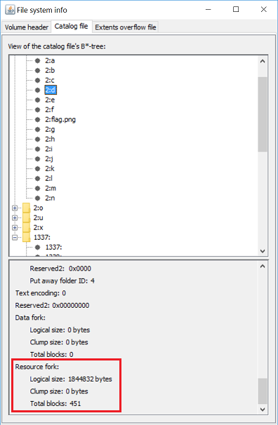
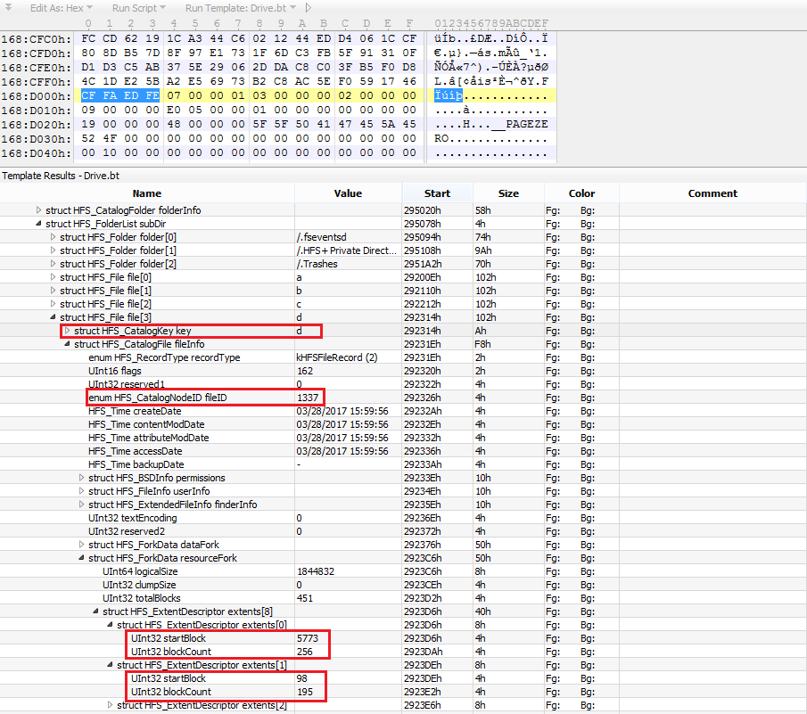

# Teaser CONFidence CTF 2017 - INDEX challenge writeup
_chksum[0]/Michael Kajiloti_

## Challenge Description
##### INDEX (Forensics, 400)
_A hipster friend who uses macs and listens to weird music sent me a disk image and this note:_
>I’m a collector and I’ve always been misunderstood
>I like the things that people always seem to overlook
>I gather up and catalog it in a book I wrote
>There’s so much now that I forget if I don’t make a note

[Download](https://s3.eu-central-1.amazonaws.com/dragonsector2-ctf-prod/index_cb9ed1eb3a9096700e5a821d0c3866fb806ac6522bdbdf5846a205e96cbc91fa/index.img.xz)

### Hey... Steven Wilson is not Weird!
I immediately recognized the text in the note, which is taken from the [lyrics](http://www.azlyrics.com/lyrics/stevenwilson/index293967.html) of a Steven Wilson song called [Index](https://www.youtube.com/watch?v=-UoKIiw-p2g).
Unfortunately, this observation didn't prove to be helpful in solving the challenge, but it did make me want to listen to Steven Wilson.
Anyways, I want to clarify that Steven Wilson is not weird, he is genius, and that hipster friend has good taste in music :)
Now that that's clear...

## It said he uses macs
Downloading the disk image file, and running  _file_ on it, revealed that its an [HFS+ disk image](https://en.wikipedia.org/wiki/HFS_Plus), used on macOS, which is not surprising considering the challenge description.

I used [HFSexplorer](http://www.catacombae.org/hfsexplorer/) to open and extract the disk image's contents, and found that it contains a root folder called `INDEX`, inside a `flag.png` file and 26 duplicates of it named `a` to `z` accordingly. Another duplicate file called `inode19` was located at `HFS+ Private Data` folder. Now that's weird (not Steven Wilson!). Steganography? Maybe.. but even then I needed more clues to continue.
The only other thing inside the disk image was a `.fseventsd` folder, with 4 small gzipped files inside. That's it?

### What are you hiding?
Inspecting the disk image manually in a hex editor, showed it contains many golang runtime strings, which is suspicious as I couldn't find a golang binary with HFSexplorer. Besides, the image file was around 25MB, and seemed to contain a lot of binary data that is not visible as files on the filesystem. I assumed the golang file, among others, were deleted from the filesystem, so I tried using forensics tools such as [The Sleuth Kit](https://wiki.sleuthkit.org/index.php?title=The_Sleuth_Kit) and some disk recovery programs in order to detect/recover the deleted files, but I got no results.

I was then reminded that binwalk exists! So I ran binwalk with high hopes... only to learn what I already know...
```
DECIMAL       HEXADECIMAL     DESCRIPTION
--------------------------------------------------------------------------------
513504        0x7D5E0         Unix path: /usr/lib/locale/TZ/
537952        0x83560         Unix path: /usr/share/lib/zoneinfo/
553600        0x87280         Unix path: /usr/local/Cellar/go/1.6.1/libexec
975424        0xEE240         Unix path: /usr/local/Cellar/go/1.6.1/libexec/src/unicode/tables.go
1059833       0x102BF9        Minix filesystem, V1, little endian, 0 zones
--- SNIPPED ----
1060121       0x102D19        Minix filesystem, V1, little endian, 0 zones
4530176       0x452000        PNG image, 2000 x 2153, 8-bit/color RGBA, non-interlaced
4530364       0x4520BC        Unix path: /www.w3.org/1999/02/22-rdf-syntax-ns#">
4530578       0x452192        Unix path: /purl.org/dc/elements/1.1/"
15228928      0xE86000        gzip compressed data, from Unix, NULL date (1970-01-01 00:00:00)
15237120      0xE88000        gzip compressed data, from Unix, NULL date (1970-01-01 00:00:00)
15241216      0xE89000        gzip compressed data, from Unix, NULL date (1970-01-01 00:00:00)
15245312      0xE8A000        gzip compressed data, from Unix, NULL date (1970-01-01 00:00:00)
24333124      0x1734B44       End of Zip archive
```

No golang binary detected. The 4 gzip files shown in the output are actually the files inside .fseventsd folder, which brings us to... what are these files?

### Always check the logs
 A quick search revleaed these to be [filesystem events daemon logs](https://techblog.willshouse.com/2011/05/05/what-is-fseventsd/). I parsed them using a useful tool called [FSEventsParser](https://github.com/dlcowen/FSEventsParser), which resulted in some interesting filesystem logs (snipped results shown).

| wd                   | mask_hex   | filename             | mask                                                              | record_end_offset | source              | source_created_time        | source_modified_time       | other_dates |
|----------------------|------------|----------------------|-------------------------------------------------------------------|-------------------|---------------------|----------------------------|----------------------------|-------------|
| 18147469118082277088 | 0x04000003 | NULL                 | FolderEvent;Mount;InodeMetaMod;                                   | 25                | ..\fbd8c30373aa5f99 | 2017-04-02 04:36:50.684744 | 2017-04-02 04:36:50.685744 | UNKNOWN     |
| 18147469118082268290 | 0x48000001 | .Trashes             | FolderEvent;Renamed;FinderInfoMod;                                | 46                | ..\fbd8c30373aa5f99 | 2017-04-02 04:36:50.684744 | 2017-04-02 04:36:50.685744 | UNKNOWN     |
| 18147469118082268286 | 0x88010001 | .Trashes.kuFGRj      | FolderEvent;Renamed;PermissionChange;FolderCreated;               | 74                | ..\fbd8c30373aa5f99 | 2017-04-02 04:36:50.684744 | 2017-04-02 04:36:50.685744 | UNKNOWN     |
| 18147469118082273077 | 0x03009000 | __1__                    | Created;HardLink;__Removed__;FileEvent;                               | 88                | ..\fbd8c30373aa5f99 | 2017-04-02 04:36:50.684744 | 2017-04-02 04:36:50.685744 | UNKNOWN     |
| 18147469118082273104 | 0x03009000 | __10__                   | Created;HardLink;__Removed__;FileEvent;                               | 103               | ..\fbd8c30373aa5f99 | 2017-04-02 04:36:50.684744 | 2017-04-02 04:36:50.685744 | UNKNOWN     |
| 18147469118082273374 | 0x03009000 | __100__                  | Created;HardLink;__Removed__;FileEvent;                               | 119               | ..\fbd8c30373aa5f99 | 2017-04-02 04:36:50.684744 | 2017-04-02 04:36:50.685744 | UNKNOWN     |
| 18147469118082276074 | 0x03009000 | __1000__                 | Created;HardLink;__Removed__;FileEvent;                               | 136               | ..\fbd8c30373aa5f99 | 2017-04-02 04:36:50.684744 | 2017-04-02 04:36:50.685744 | UNKNOWN      |
| >> SNIPPED
| 18147469118082268320 | 0x01009000 | a                    | Created;HardLink;FileEvent;                                       | 21268             | ..\fbd8c30373aa5f99 | 2017-04-02 04:36:50.684744 | 2017-04-02 04:36:50.685744 | UNKNOWN     |
| 18147469118082268326 | 0x01009000 | b                    | Created;HardLink;FileEvent;                                       | 21282             | ..\fbd8c30373aa5f99 | 2017-04-02 04:36:50.684744 | 2017-04-02 04:36:50.685744 | UNKNOWN     |
| 18147469118082268329 | 0x01009000 | c                    | Created;HardLink;FileEvent;                                       | 21296             | ..\fbd8c30373aa5f99 | 2017-04-02 04:36:50.684744 | 2017-04-02 04:36:50.685744 | UNKNOWN     |
| 18147469118082277254 | 0x15028000 | __d__                    | Modified;InodeMetaMod;Created;__ExtendedAttrModified__;FileEvent;     | 21310             | ..\fbd8c30373aa5f99 | 2017-04-02 04:36:50.684744 | 2017-04-02 04:36:50.685744 | UNKNOWN     |
| 18147469118082277010 | 0x01009000 | e                    | Created;HardLink;FileEvent;                                       | 21324             | ..\fbd8c30373aa5f99 | 2017-04-02 04:36:50.684744 | 2017-04-02 04:36:50.685744 | UNKNOWN     |
| 18147469118082277016 | 0x01009000 | f                    | Created;HardLink;FileEvent;                                       | 21338             | ..\fbd8c30373aa5f99 | 2017-04-02 04:36:50.684744 | 2017-04-02 04:36:50.685744 | UNKNOWN     |
| 18147469118082268317 | 0x11038000 | __flag.png__             | Modified;Created;PermissionChange;__ExtendedAttrModified__;FileEvent; | 21359             | ..\fbd8c30373aa5f99 | 2017-04-02 04:36:50.684744 | 2017-04-02 04:36:50.685744 | UNKNOWN     |
| 18147469118082277019 | 0x01009000 | g                    | Created;HardLink;FileEvent;                                       | 21373             | ..\fbd8c30373aa5f99 | 2017-04-02 04:36:50.684744 | 2017-04-02 04:36:50.685744 | UNKNOWN     |
| 18147469118082277022 | 0x01009000 | h                    | Created;HardLink;FileEvent;                                       | 21387             | ..\fbd8c30373aa5f99 | 2017-04-02 04:36:50.684744 | 2017-04-02 04:36:50.685744 | UNKNOWN     | 
| >> SNIPPED
| 18147469118082277233 | 0x13008000 | __tmp1__                 | Modified;Created;__Removed__;FileEvent;                               | 21572             | ..\fbd8c30373aa5f99 | 2017-04-02 04:36:50.684744 | 2017-04-02 04:36:50.685744 | UNKNOWN     |
| >> SNIPPED
| 18147469118082277260 | 0x13008000 | __tmp12__                | Modified;Created;__Removed__;FileEvent;                               | 21626             | ..\fbd8c30373aa5f99 | 2017-04-02 04:36:50.684744 | 2017-04-02 04:36:50.685744 | UNKNOWN     |
| >> SNIPPED
| 18147469118082277067 | 0x01009000 | u                    | Created;HardLink;FileEvent;                                       | 21776             | ..\fbd8c30373aa5f99 | 2017-04-02 04:36:50.684744 | 2017-04-02 04:36:50.685744 | UNKNOWN     |
| 18147469118082277070 | 0x01009000 | v                    | Created;HardLink;FileEvent;                                       | 21790             | ..\fbd8c30373aa5f99 | 2017-04-02 04:36:50.684744 | 2017-04-02 04:36:50.685744 | UNKNOWN     |
| >> SNIPPED

From the logs we learn:
- Files with names numbered `1` - `1311` were created and deleted (all hardlinks)
- 12 Other files, named `tmp1` - `tmp12` were created and deleted (all hardlinks)
- Among the files that were not deleted, files `d` and `flag.png` had their extended attributes modified

### What was that about "catalog" in the note?
All of this is intersting, but what's next?.
Reading a bit on HFS reveals that it works with a catalog file (It's in the song duh!) that stores the directory structure and filesystem metadata. Conveniently, HFSExplorer has a catalog file view, that allows you to inspect the structure and metadata of the filesystem.

What immediately pops up is the node numbered `1337` (looks like a hint..), There is a gap of 1311 between it and the previous node `26`, (That explains the deleted numbered 1-1311 files in the logs..).
Going over the file nodes, reveals nodeID `1337` belongs to the file `d`. After examining this file's metadata carefully, I noticed it has a [Resource Fork](https://en.wikipedia.org/wiki/Resource_fork), which is sort of macOS's version of alternate data stream in Windows. AHA! so this is what _"people tend to overlook"_.



Also, a bit more digging reveals that nodeID `19` (`iNode19` file) is the only file with a data fork, meaning its the original flag.png file. All the other "flag" duplicates are hard links to it.

### Just let me see what you got there
Turns out, _viewing_ the resource fork itself is not so simple...
Mounting the drive on a mac and using the native command `index.img/..namedfork/rsrc` shows it actually has no resource fork. Using multiple different forensic tools, yielded the same results. Maybe it has something to do with what we saw in the logs - that the metadata for `d` has been modified. Also HFSexplorer doesn't show where the resource fork is actually located on the disk.

After getting stuck and frustrated for an hour or two, doing some crazy [HFS research here](https://developer.apple.com/legacy/library/technotes/tn/tn1150.html), I got a great advice and downloaded this [HFS drive template for 010 editor](https://www.sweetscape.com/010editor/repository/files/Drive.bt). This allowed me to actually see the resource fork's location and size in blocks on disk. The resource fork's data is split in 2 locations (extents) on disk. Looking at the volume header we can see the block size is `4096` bytes, and the first extent's startBlock is `5773`, so the address in bytes is `0x168D000`.



And what do you know... it's a 64bit mach-o binary file signature. Useless automated forensic tools!
Extracting the 2 data pieces, appending them together to a single file, and opening it in IDA, shows its a golang binary. More precisely THE golang binary I was looking for!

### Solve it for me please
Running the executable as is, simply does nothing.
Now, we assumed that this binary contains the logic to extract the flag text from the `flag.png` file.
Looking at the strings inside the binary we saw what seemed like a file path: `/.vol/16777221/19`. I recognized the number `19`, as being the original flag file `inode19`.
Since we had a mac nearby, we simply copied `flag.png` to `/.vol/16777221/19` and ran the executable.

It worked! the binary printed out the flag! I love Steven Wilson!

### Last but not least
If you came this far, check out [porcupine tree](https://en.wikipedia.org/wiki/Porcupine_Tree), they are amazing.

_chksum[0]_


